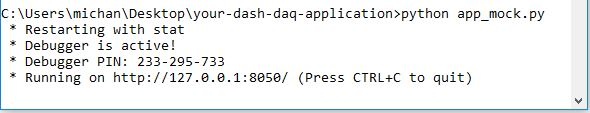

# Dash-Blinkstick

## Introduction
A mock app to control a [LED Blinkstick](https://www.blinkstick.com/products/blinkstick-strip), an LED stick you can control from your computer! [Play with the demo](https://dash-daq-led.herokuapp.com/) and learn more about this application from our [blog entry](https://www.dashdaq.io/control-an-led-strip-in-python).

### Light Emitting Diode Stick
The LED BlinkStick, is an stick consisting of eight semi-conductor light emitting diodes. An diode is an electrical component that only allows electrical current to travel in one direction. When sufficient current passes through an LED, electrons cause this special diode to release energy, as photons. Photons are simply light particles, which is why we see the LED light up! This process is known as electrolumnience, to learn more read this awesome Wikipedia [page](https://en.wikipedia.org/wiki/Electroluminescence).

### dash-daq
[Dash DAQ](http://dash-daq.netlify.com/#about) is a data acquisition and control package built on top of Plotly's [Dash](https://plot.ly/products/dash/). It gives users more accesibility and, key features for data aquistion applications.


## Requirements
It is advisable	to create a separate conda environment running Python 3 for the app and install all of the required packages there. To do so, run (any version of Python 3 will work):

```
conda create -n	[your environment name] python=3.6.4
```
```
source activate [your environment name]
```

To install all of the required packages to this conda environment, simply run:

```
pip install -r requirements.txt
```

and all of the required `pip` packages,  will be installed, and the app will be able to run.
 
## How to use the app
There are two versions of this application. A mock version for the user to play with, without any instruments connected, and a local version, that can be connected to a device.

If you would like to run the local version, please connect the device to the USB port on your computer, and run in the command line:

``` 
python app.py
```


and you should see this:


Open the web address given to you in your browser like so:


If the app is run, but the device is not connected you will see something like this:


If you would like to run the mock version, run in the command line:

```
python app_mock.py 
```


and you should see this:



Open the web address given to you in your browser like so:


### Controls
* On/Off: Turn Blinkstick LED's on or off. 
* LED Select: Select individual LED's and change their color, with the color picker.
* All: Select all LED's and modify their colors simutaneously, with the color picker.
* Rainbow: All LED's light up according to the rainbow color spectrum.
* LED Slider: Turn on LED's one through to the selection on the slider, and change the color with color picker.
* Color Picker: Change the color of the LED/LED's to the color selected.


## Resources
The Blinkstick API is used in this application, and has a ton of features. If you need some help figuring out the Blinkstick API check out the documentation [here](https://www.blinkstick.com/documentation/python/frames.html). Too install the Blinkstick API go [here](https://github.com/arvydas/blinkstick-python). If you have trouble using the API with Python 3, check out this [fix](https://github.com/arvydas/blinkstick-python/issues/34)


